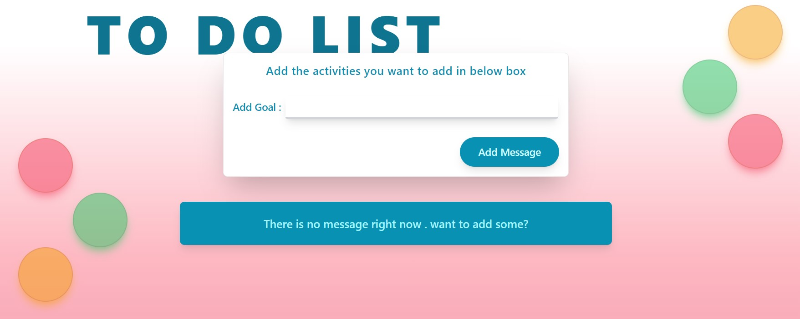
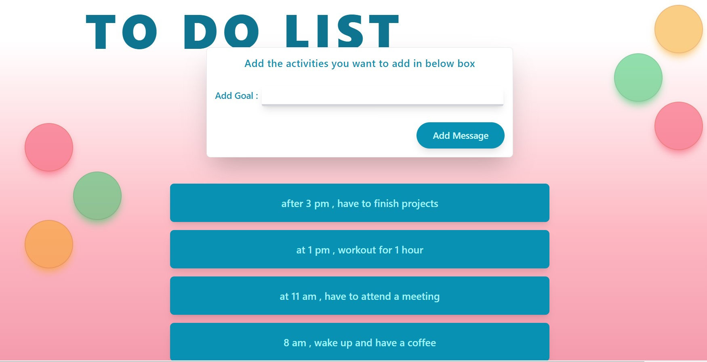

# About this assignment :
this is an assignment given to us in order to practice some fundamental concepts of reactjs . this assignment is all about working withs states and props in reactjs. 
the styling part of the assigment is carried out using tailwindcss . below is the screenshot of the assignment.
</img>

in this assignment , a user can add daily goals in order to efficiently utilize the time .

</img>